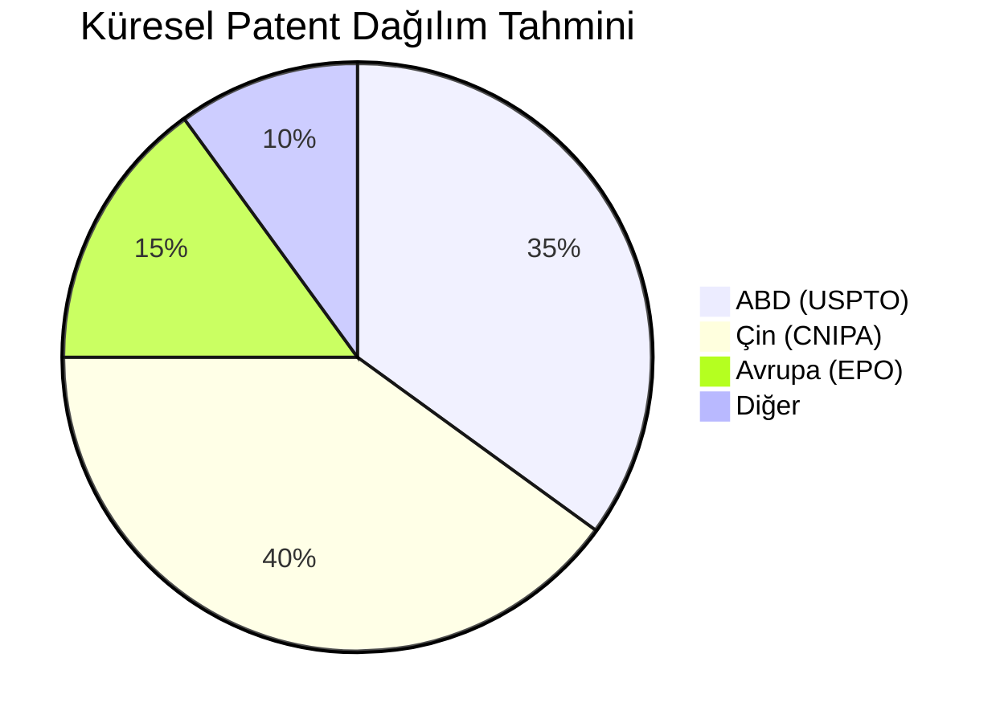

# ⚖️ DOMINION_LEGAL: International Frameworks & Litigation

Patent dünyasının anayasası ve savaş meydanı. Uluslararası anlaşmalar ve yasal süreçler.

## 🌍 Uluslararası Başvuru Kanalları
- **PCT (Patent Cooperation Treaty):** Tek başvuru ile 150+ ülkede hak koruma süreci başlatma.
- **EP (European Patent):** Avrupa ülkelerinde tekil veya üniter koruma.
- **National Phase:** Ülke bazlı tescil ve yerelleştirme süreçleri.

## ⚔️ Yasal Mücadele ve İhlal
- **Infringement Analysis:** Patent ihlali tespiti (Element-by-element analysis).
- **Cease and Desist:** İhtarname süreçleri ve müzakere taktikleri.
- **Invalidation Actions:** Rakip patentlerin iptal edilmesi süreçleri.

## 📜 Lisanslama ve Transfer
- Exclusive vs. Non-exclusive lisanslar.
- Devir (Assignment) protokolleri.
- Royalti hesaplama modelleri.

---

