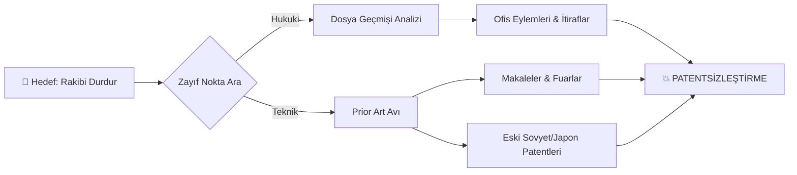

# 🔍 DOMINION_SEARCH: The High-Frequency Radar

> **"Görmediğin düşman, seni öldüren düşmandır."**

Patent dünyasında "bilmemek" mazeret değil, intihardır. Bu Dominion, **Deep Web**, **Akademik Arşivler** ve **Küresel Veritabanlarının** en karanlık köşelerinde "Görünmez Tehditleri" avlama merkezidir. Sıradan bir Google araması sizi "Her şey temiz" yanılgısına düşürür; **PatentWarrior Search Protocol** ise gerçeği, ne kadar derine gömülürse gömülsün, bulup çıkarır.

---

## 🛰️ Deep Stacks Intelligence (Derin İstihbarat)

### 1. Invalidation Warfare (Hükümsüz Kılma Savaşı) 🔥
Rakibinizin "geçilemez" dediği bir patenti mi var? Yanılıyorlar. Tarihte "yıkılamaz" olan hiçbir patent yoktur; sadece yeterince aranmamış "Prior Art" (Önceki Teknik) vardır.
*   **Mission:** Rakip patentin başvuru tarihinden **bir gün önce** yayınlanmış o tek dökümanı bulmak.
*   **Target:** Japonca kullanım kılavuzları, 1990'lardan kalma doktora tezleri, WayBack Machine'deki silinmiş web siteleri.

### 2. Freedom to Operate (FTO) - "The Minefield Map" 💣
Ürününüzü piyasaya sürdükten sonra gelen bir "Cease and Desist" (İhtarnet) mektubu, projenin ölüm fermanıdır. FTO analizi, mayın tarlasında güvenli bir patika çizmektir.
*   **Protokol:** Ürünün her bir bileşenini (vida, yazılım, ekran, pil) ayrı ayrı analiz et. Riskli bölgeleri kırmızı ile işaretle ve AR-GE ekibine "Buradan geçmeyin" emri ver.

---

## 🕵️ Forensics Toolkit (Adli Bilişim Araçları)

Sadece kelime araması yapmak amatör işidir. Biz **Kavramsal** ve **Sınıflandırma** tabanlı avcılık yaparız.

| Araç/Yöntem | Açıklama | Güç Seviyesi |
| :--- | :--- | :---: |
| **CPC/IPC Classifications** | Patentlerin genetik kodları. Yanlış kelimelerle gizlenmiş patentleri bulur. | ⭐⭐⭐⭐⭐ |
| **Citation Trees (Forward/Backward)** | Bir patentin "Atalarını" ve "Torunlarını" takip ederek tüm soy ağacını (aile ağacını) ortaya çıkarma. | ⭐⭐⭐⭐ |
| **Assignee/Inventor Tracking** | Rakip şirketin "Yıldız Mühendisi" nereye gitti? Hangi konuda yayın yapıyor? İnsanları takip et, teknolojiye ulaşırsın. | ⭐⭐⭐ |

---

## 🧬 Search Algorithms

---

## ⚡ Elite Search Tactics

*   **Zaman Makinesi:** Bazen en iyi kanıt, rakibinizin kendi eski web sitesidir. Ürünlerini patent başvurusundan önce "Coming Soon" diye duyurdular mı? Eğer öyleyse, kendi patentlerini kendileri **imha etmiş** olabilirler. Buna "Self-Collision" denir.
*   **Dil Bariyerini Aş:** Sadece İngilizce aramak, dünyanın %40'ını ıskalamaktır. Çin (CN), Japonya (JP) ve Kore (KR) veritabanları, batılı şirketlerin en büyük kabusudur. PatentWarrior, bu bariyerleri yıkar.

> [!IMPORTANT]
> **Kural 1:** "Bulamadım" demek, "Yok" demek değildir. Sadece "Henüz bulamadım" demektir. Aramaya devam et.
