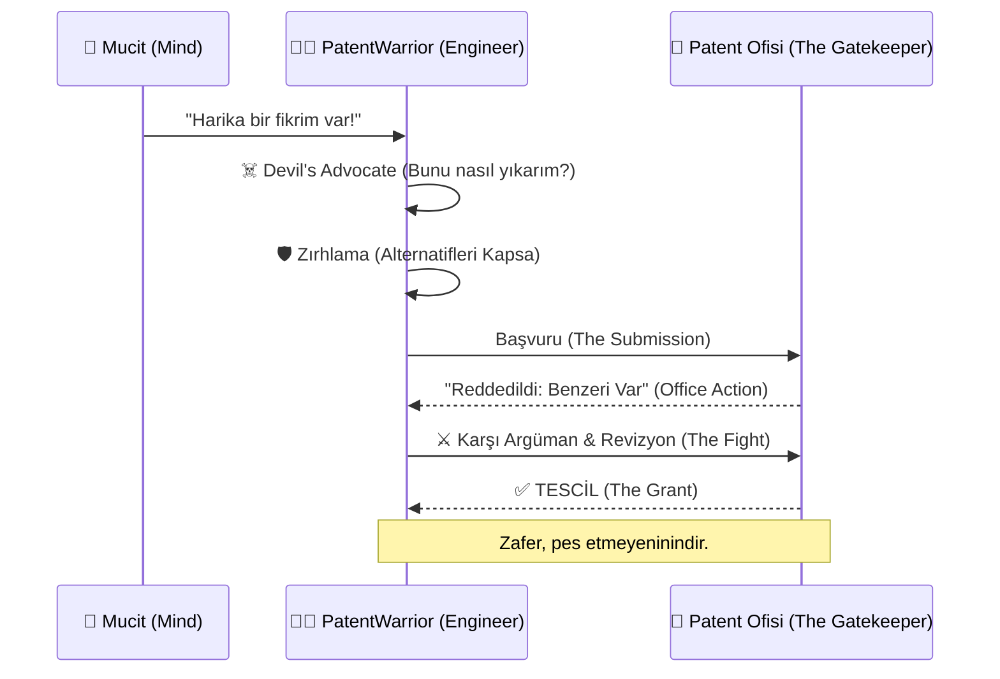

# 🛠️ DOMINION_TECHNICAL: The Forge of Invincibility

> **"Kelimeler, mühendisin harcı; istemler ise inşa ettiği kalenin duvarlarıdır."**

Burası, bir fikrin **hukuki bir silaha** dönüştüğü atölyedir. İyi bir mühendis harika bir ürün yapar; **PatentWarrior** ise o ürünü kopyalanamaz bir anıta dönüştürür. Bu Dominion'da, "Claim Drafting" (İstem Yazımı) sanatını sıradan bir prosedürden, cerrahi bir hassasiyet gerektiren bir mühendislik disiplinine yükseltiyoruz.

---

## 🏛️ The Architecture of Monopoly (Tekel Mimarisi)

Patent yazmak, gelecekteki olası tüm kaçış yollarını bugünden kapatmaktır.

### 🧱 1. Diamond-Hard Claims (Elmas Sertliğinde İstemler)
İstemler (Claims), patentin kalbidir. Muğlak ifadeler ("yaklaşık", "büyük ölçüde") düşmanınıza kapı aralar.
*   **Broad vs. Narrow:** İstemleriniz bir okyanus kadar geniş (tüm varyasyonları kapsayan) ama bir lazer kadar keskin (önceki teknikten ayrışan) olmalıdır. Bu **"Goldilocks Zone"**u bulmak ustalık gerektirir.
*   **Picasso Prensibi:** Bir şeyi anlatmak için değil, **tanımlamak** için yazın. Gereksiz her kelime, rakibin "Ben bunu kullanmıyorum" demesi için bir şanstır.

### 👻 2. Functional Claiming (İşlevsel Tanımlama)
"*Bir vida ile tutturulmuş*" demek yerine "*...birbirine sabitlenmesi için yapılandırılmış sabitleme elemanı*" deyin.
*   **Neden?** Rakibiniz vida yerine kaynak kullanırsa patentinizi deler. "Sabitleme elemanı" ise vidayı, kaynağı, yapıştırıcıyı ve gelecekte icat edilecek lazer kaynağını bile kapsar. **Buna "Future-Proofing" (Geleceğe Hazırlık) denir.**

### 🎭 3. Alternative Embodiments (Alternatif Bedenlenmeler)
Kendi buluşunuza saldıran ilk kişi siz olun. "Bunu başka nasıl yapardım?" diye sorun.
*   *Örnek:* Eğer sensörünüz ışıkla çalışıyorsa, rakibiniz sesle çalışanını yapabilir mi? Patentinize "optik, akustik veya elektromanyetik sensör" yazarak o kapıyı da kilitleyin.

---

## 📐 Blueprinting Excellence (Görsel Mükemmellik)

Bir resim bin kelimeye, iyi bir patent çizimi ise milyon dolara bedeldir.

*   **Exploded Views (Patlatılmış Görünümler):** Karmaşık mekanizmaları atomlarına ayırarak gösterin. Hâkimler ve incelemeciler mühendis değildir; onlara bir LEGO şeması gibi netlik sunun.
*   **Flowchart Logic:** Algoritmaları ve iş akışlarını, bir yazılımcının "Pseudo-Code"u gibi adım adım işleyin.

---

## ⚙️ The Protocol: From Mind to Market

---

## ⚡ Master Class Tactics

1.  **The "Picture Claim" Fallacy:** Asla sadece ürününüzün fotoğrafını çeker gibi istem yazmayın. Ürünü değil, **kavramı** patentleyin.
2.  **Lexicography (Kendi Sözlüğünü Yaz):** Patent içinde terimleri siz tanımlayın. "Akıllı Modül" dediğinizde bunun ne anlama geldiğini siz belirlerseniz, mahkemede başkası bunu eğip bükemez.

> [!TIP]
> **Pro Tip:** En iyi patent, rakibinizin ürününü eline aldığında "Lanet olsun, bunu kullanmadan nefes bile alamam!" dediği patenttir.
