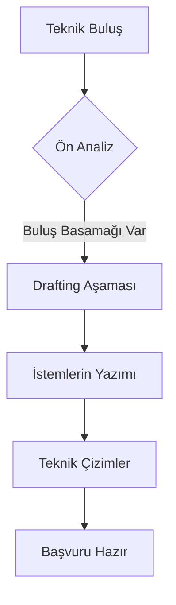

# 🛠️ DOMINION_TECHNICAL: Patent Drafting & Engineering

Patent yazımı, mühendislik ile hukukun kesiştiği en uç noktadır. Bu modül, elit seviyede patent hazırlama protokollerini içerir.

## 📝 Teknik Yazım Protokolleri
- **Specification (Açıklama):** Buluşun en küçük detayına kadar teknik anlatımı.
- **Best Mode Requirement:** Buluşun en iyi uygulama biçiminin açıklanması.
- **Enablement:** Uzman bir kişinin buluşu uygulayabilmesini sağlayacak derinlik.

## 🏗️ İstem (Claim) İnşası
- **Independent Claims:** Bağımsız ana koruma alanı.
- **Dependent Claims:** Alt detaylar ve savunma katmanları.
- **Functional Claiming:** İşlevsel tanımlamalarla koruma alanını genişletme.

## 🎨 Görsel Dokümantasyon
- Teknik çizim standartları.
- Akış diyagramları (Flowcharts) ve devre şemaları.
- Referans numaralandırma sistemleri.

---

